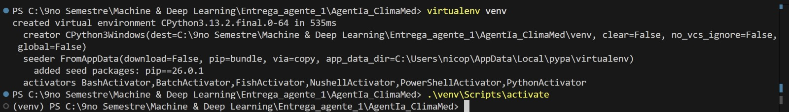
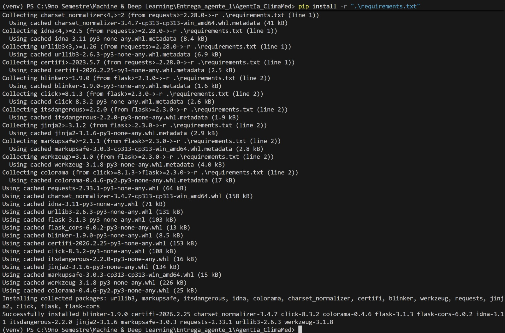
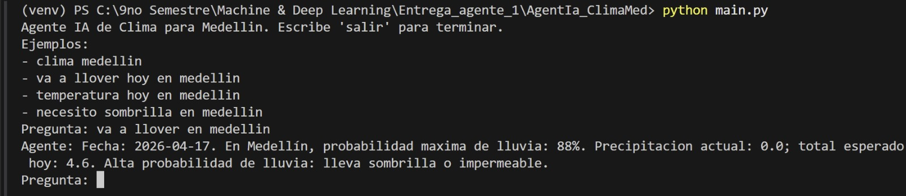
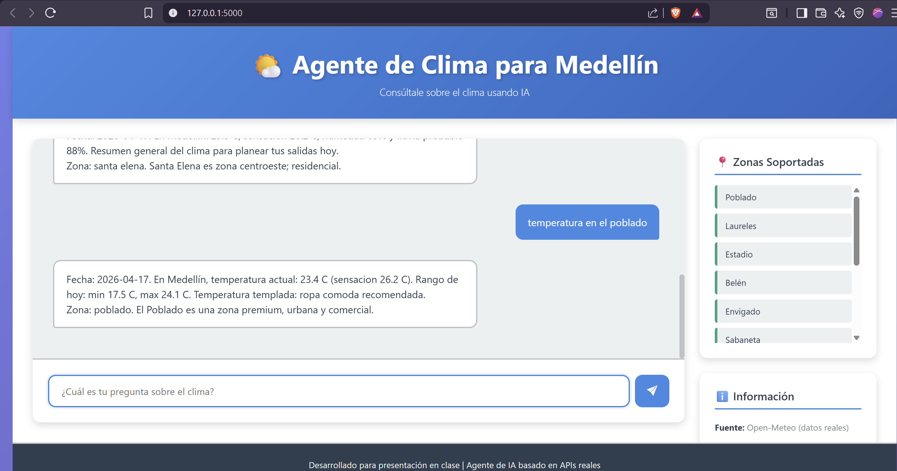
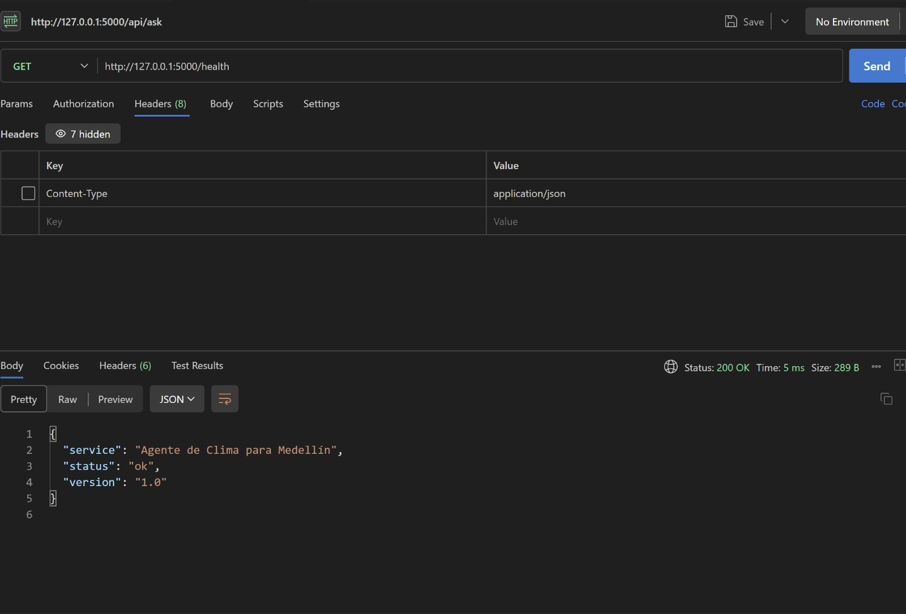
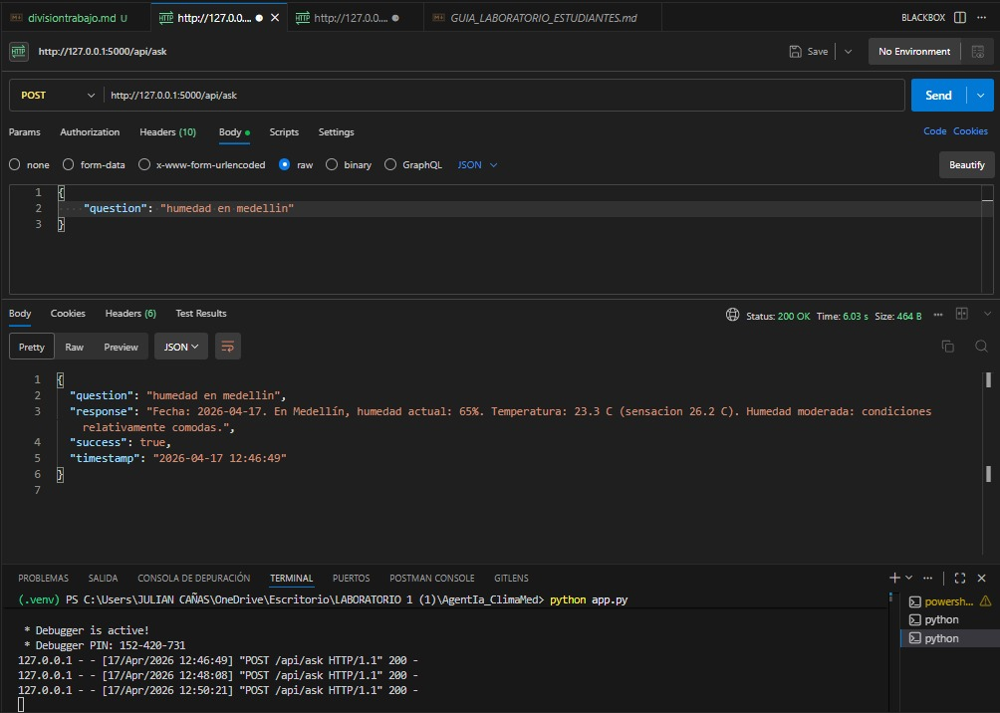
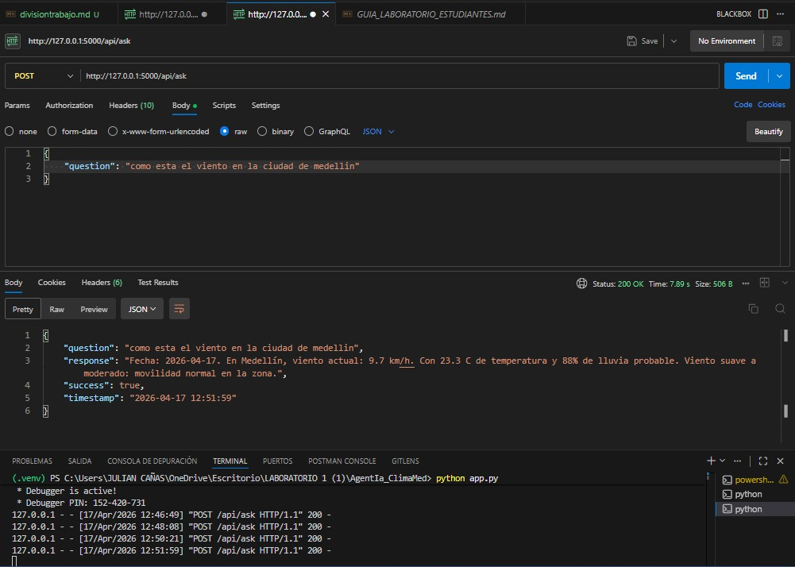
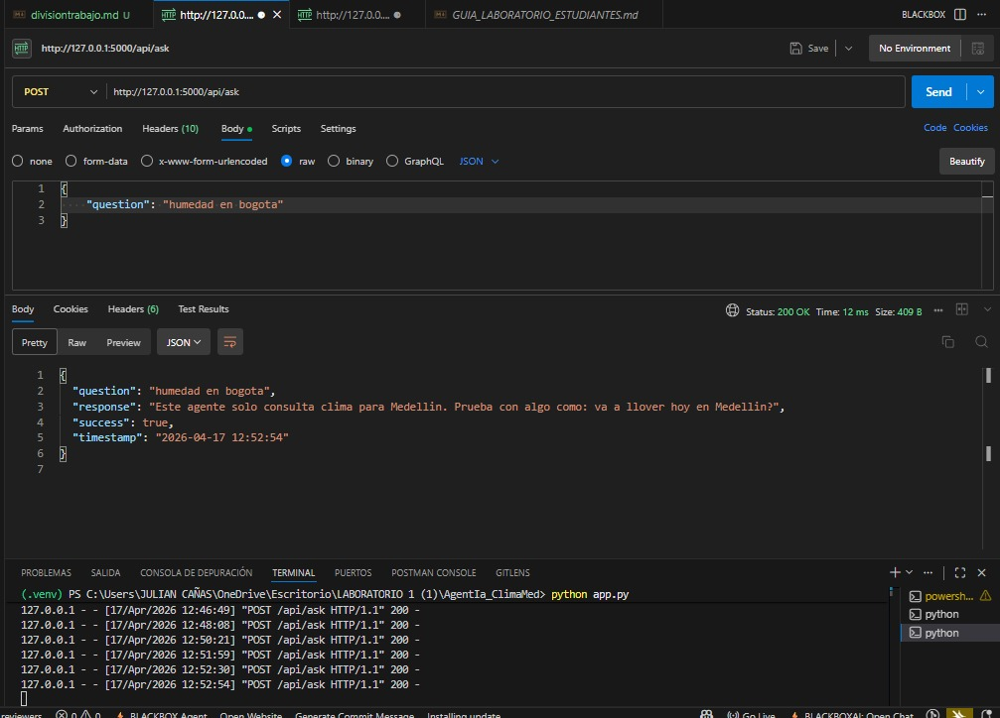
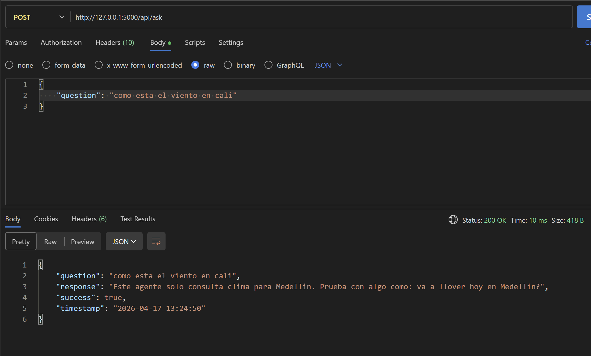

# Evidencias y Respuestas - Laboratorio Agente de IA Clima

A continuación se recopilan las capturas que documentan el desarrollo práctico del laboratorio, seguidas de las respuestas al cuestionario final.

---

## Parte D - Evidencias de Entrega

### 1. Captura de terminal con instalación (venv + pip)

### 2. Captura de CLI respondiendo una pregunta (Parte de Nicolás)

### 3. Captura de navegador con la interfaz web y Health Check (Parte de Nicolás)

### 4. Capturas de API y validaciones de ciudades (Parte de Julio)
**Consultas comparativas entre Humedad vs Viento:**

**Rechazo a consultas de ciudades ajenas (Bogotá y Cali):**

---

## Parte E - Preguntas Cortas

### 👨‍💻 Respuestas de Nicolás

**1. ¿Qué API aporta los datos reales del clima?**  
    R: La API utilizada para extraer la información meteorológica real es Open-Meteo (como se menciona en los requisitos del laboratorio). Es una API de código abierto que no requiere clave de autenticación y entrega los datos según las coordenadas geográficas consultadas.

**2. ¿Qué pasa si Ollama no está disponible?**  
    R: Si Ollama no está disponible, el agente no puede ejecutar el modelo de lenguaje (Llama 3) para procesar el lenguaje natural. Sin embargo, el código está diseñado con un mecanismo de "fallback" (reserva). En este caso, el agente no falla por completo; en su lugar, devuelve una respuesta predefinida y estática que indica que está experimentando dificultades técnicas, pero que puede proporcionar información básica sobre el clima en Medellín.

---

### 👨‍💻 Respuestas de Julio

**3. ¿Por qué este agente no responde sobre Bogotá o Cali?**  
    R: El agente de clima restringe consultas a Medellín mediante:
    
        1. *Validación Lógica*: Constante SUPPORTED_CITY = "medellin" en weather_agent_real.py (línea 18); función agent() rechaza ciudades no coincidentes (líneas 280-281).
    
        2. *Restricción API*: geocode_medellin() y get_weather_forecast() en weather_api.py hardcodean coordenadas de Medellín (líneas 11-48), sin parametrización.
    
        3. *Instrucciones LLM*: Prompt fija "Ciudad fija del agente: Medellin" (línea 129).
    Esta configuración multinivel asegura integridad, rechazando consultas sobre Bogotá o Cali antes de procesar datos externos.

**4. ¿Qué ventaja tiene separar CLI, Web y API?**  
    R: Separar CLI, Web y API mejora la arquitectura al permitir:

        **Modularidad**: Desarrollo independiente de cada componente, facilitando mantenimiento y actualizaciones.
        **Reutilización**: API compartida para múltiples interfaces, optimizando recursos.
        **Escalabilidad**: Capa API maneja cargas altas; interfaces ligeras se adaptan rápidamente.
        **Separación de responsabilidades**: CLI para técnicos, Web para usuarios, API para lógica central.
        **Pruebas y seguridad**: Testing aislado y autenticación centralizada.
    
    Esto resulta en un sistema robusto y flexible.