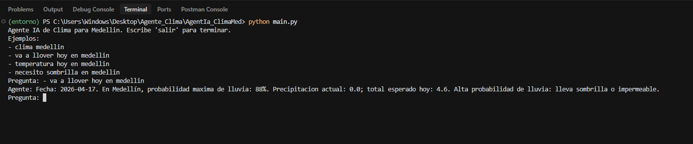
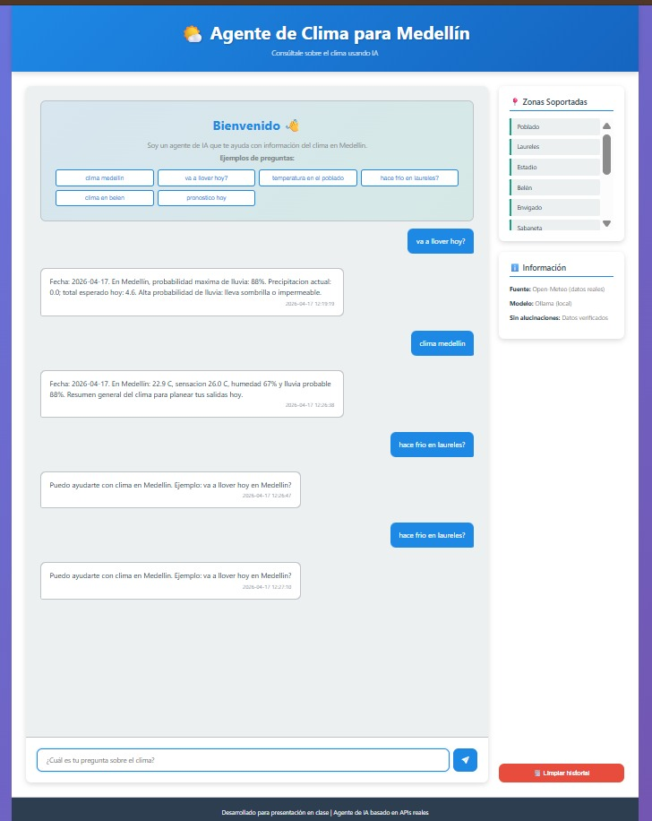
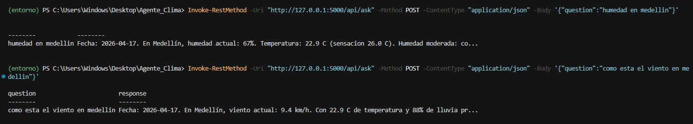

# Entrega — Registro de ejecuciones (laboratorio)

Contenido trasladado desde `ejecuciones.txt`.

---

## 4. Probar el modo terminal (CLI)

```
(entorno) PS C:\Users\Windows\Desktop\Agente_Clima\AgentIa_ClimaMed> python main.py
Agente IA de Clima para Medellin. Escribe 'salir' para terminar.
Ejemplos:
- clima medellin
- va a llover hoy en medellin
- temperatura hoy en medellin
- necesito sombrilla en medellin
Pregunta: como esta el clima hoy ?
Agente: Fecha: 2026-04-17. En Medellín: 22.9 C, sensacion 26.0 C, humedad 67% y lluvia probable 88%. Resumen general del clima para planear tus salidas hoy.
Pregunta:
```

### Captura 1



---

## 5. Probar la web (Flask)

```
(entorno) PS C:\Users\Windows\Desktop\Agente_Clima\AgentIa_ClimaMed> python app.py

======================================================================
  AGENTE DE IA PARA CLIMA EN MEDELLÍN - WEB SERVER
======================================================================

🚀 Servidor iniciado en http://localhost:5000
📊 Abre tu navegador y accede a http://localhost:5000

 * Serving Flask app 'app'
 * Debug mode: on
WARNING: This is a development server. Do not use it in a production deployment. Use a production WSGI server instead.
 * Running on all addresses (0.0.0.0)
 * Running on http://127.0.0.1:5000
 * Running on http://192.168.1.150:5000
Press CTRL+C to quit
 * Restarting with stat

======================================================================
  AGENTE DE IA PARA CLIMA EN MEDELLÍN - WEB SERVER
======================================================================

🚀 Servidor iniciado en http://localhost:5000
📊 Abre tu navegador y accede a http://localhost:5000

 * Debugger is active!
 * Debugger PIN: 528-340-681
127.0.0.1 - - [17/Apr/2026 12:19:03] "GET / HTTP/1.1" 200 -
127.0.0.1 - - [17/Apr/2026 12:19:03] "GET /static/style.css HTTP/1.1" 200 -
127.0.0.1 - - [17/Apr/2026 12:19:03] "GET /static/script.js HTTP/1.1" 200 -
127.0.0.1 - - [17/Apr/2026 12:19:03] "GET /api/examples HTTP/1.1" 200 -
127.0.0.1 - - [17/Apr/2026 12:19:04] "GET /api/zones HTTP/1.1" 200 -
127.0.0.1 - - [17/Apr/2026 12:19:04] "GET /health HTTP/1.1" 200 -
127.0.0.1 - - [17/Apr/2026 12:19:04] "GET /favicon.ico HTTP/1.1" 404 -
127.0.0.1 - - [17/Apr/2026 12:19:19] "POST /api/ask HTTP/1.1" 200 -


Fecha: 2026-04-17. En Medellín, probabilidad maxima de lluvia: 88%. Precipitacion actual: 0.0; total esperado hoy: 4.6. Alta probabilidad de lluvia: lleva sombrilla o impermeable.
```

---

### Captura 2




## 6. Comprobar `/health`

```
(entorno) PS C:\Users\Windows\Desktop\Agente_Clima> Invoke-RestMethod -Uri "http://127.0.0.1:5000/health" -Method GET

service                       status version
-------                       ------ -------
Agente de Clima para Medellín ok     1.0
```

---


## 7. Probar la API `POST /api/ask`

### Humedad

```
(entorno) PS C:\Users\Windows\Desktop\Agente_Clima> Invoke-RestMethod -Uri "http://127.0.0.1:5000/api/ask" -Method POST -ContentType "application/json" -Body '{"question":"humedad en medellin"}'

question            response
--------            --------
humedad en medellin Fecha: 2026-04-17. En Medellín, humedad actual: 67%. Temperatura: 22.9 C (sensacion 26.0 C). Humedad moderada: co...
```

### Viento

```
(entorno) PS C:\Users\Windows\Desktop\Agente_Clima> Invoke-RestMethod -Uri "http://127.0.0.1:5000/api/ask" -Method POST -ContentType "application/json" -Body '{"question":"como esta el viento en medellin"}'

question                        response
--------                        --------
como esta el viento en medellin Fecha: 2026-04-17. En Medellín, viento actual: 9.4 km/h. Con 22.9 C de temperatura y 88% de lluvia pr...
```

### Captura 3


